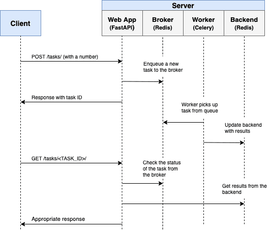

# Containerise Celery Setup 
This repo is help you to getting started with Celery.

    What is Celery?
    A mechanism to distribute work across threads or machines.
    In other words, when we have task which can be long running and 
    need not instant response so we have give the task to Celery to run.

Points:

1. you can read [Celery Documentation](https://docs.celeryq.dev/en/stable/getting-started/introduction.html)

2. Integrate with FastAPI [for long running background task](https://fastapi.tiangolo.com/tutorial/background-tasks/?h=celery#caveat)

3. You can explore [Redis](https://redis.com/solutions/use-cases/messaging/#:~:text=in%20cold%20storage.-,Task%20Queues,-A%20task%20queue) as well.

### Dependencies

* Docker version 20.10.17, build 100c701
* docker-compose version 1.29.2, build 5becea4c
* Distributor ID: Ubuntu ,Description: Ubuntu 22.04.1 LTS ,Release: 22.04 , Codename: jammy

### Installing

* Run the latest version of the code with Docker and Docker Compose:

  `docker-compose up -d`

### Executing program
  By default, the stack exposes the following ports:

    <Ports>: <Service>
    8004: Frontend(web)
    6379: Redis
    5555: Flower

## Diagram

## Authors
* [Saurav Solanki](https://github.com/sauravsolanki)

## Version History
* 0.0.1 : Initial Release

## License
This project is licensed under the Saurav Solanki License - see the LICENSE.md file for details

## Acknowledgments
* [mlflow](https://github.com/mlflow/mlflow)
* [tensorflow](https://github.com/tensorflow/tensorflow)
* [prefect](https://github.com/PrefectHQ/prefect)
* [docker](https://github.com/docker)